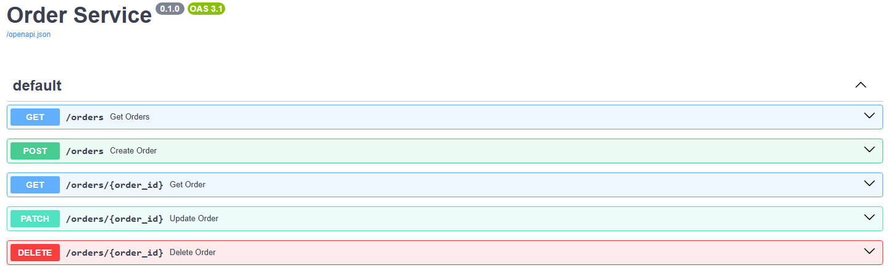
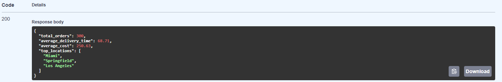

# Delivery Analytics Platform
A two-service FastAPI system that models a small-scale delivery company backend. One service stores delivery orders in a PostgreSQL database and the other service receives that data to generate analytics summaries.

 ---

 ## What It Does

 - **Orders Service (port 8000)**
    - Stores delivery data using SQLAlchemy ORM and PostgreSQL
    - Provides endpoints to create, read, update, delete, and list orders

    

- **Analytics Service (port 8001)**
    - Makes asynchronous HTTP requests to the orders service to retrieve order data
    - Exposes an API endpoint that returns a summary of the analytics

### Example response:
```json
{
  "total_orders": 300,
  "average_delivery_time": 68.71,
  "average_cost": 250.63,
  "top_locations": [
    "Miami",
    "Springfield",
    "Los Angeles"
  ]
}
```




## Features:
- Includes a database seeding script (seed_db.py) for generating example data
- SQLAlchemy ORM with session management and dependency injection
- Async inter-service communication using an HTTP client
- Real relational database integration using PostgreSQL
- Pydantic schema definitions
- Logging


## Setup
 
 ### 1. Clone the repo:
 
 ```bash
git clone https://github.com/GregMcNealAL/delivery-analytics-platform.git
cd delivery-analytics-platform
```
### 2. Create and activate virtual environment:
```bash
python -m venv venv
```

#### Windows Powershell
```bash
venv\Scripts\Activate.ps1
```
#### macOS/Linux
```bash
source venv/bin/activate
```

### 3. Install dependencies:
```bash
pip install -r requirements.txt
```

### 4. Seed the database:
```bash
python -m orders_service.seed_db
```

### 5. Run services:
#### Orders service
```bash
uvicorn orders_service.main:app --reload --port 8000
```
#### Analytics service (in another terminal)
```bash
uvicorn analytics_service.main:app --reload --port 8001
```
## Future Improvements:
- Add more analytics endpoints such as revenue over time or delivery anomalies
- Add a dashboard/frontend for visualizing metrics
- Add authentication or API keys between services
- Implement caching

## Author:
Gregory McNeal
